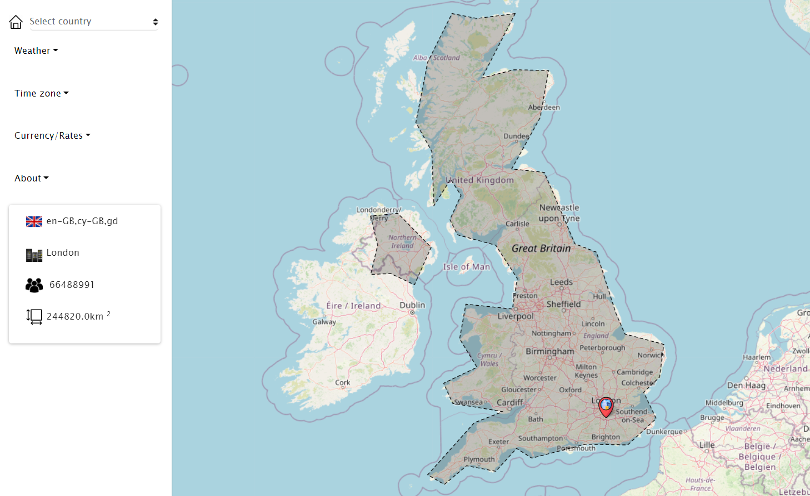
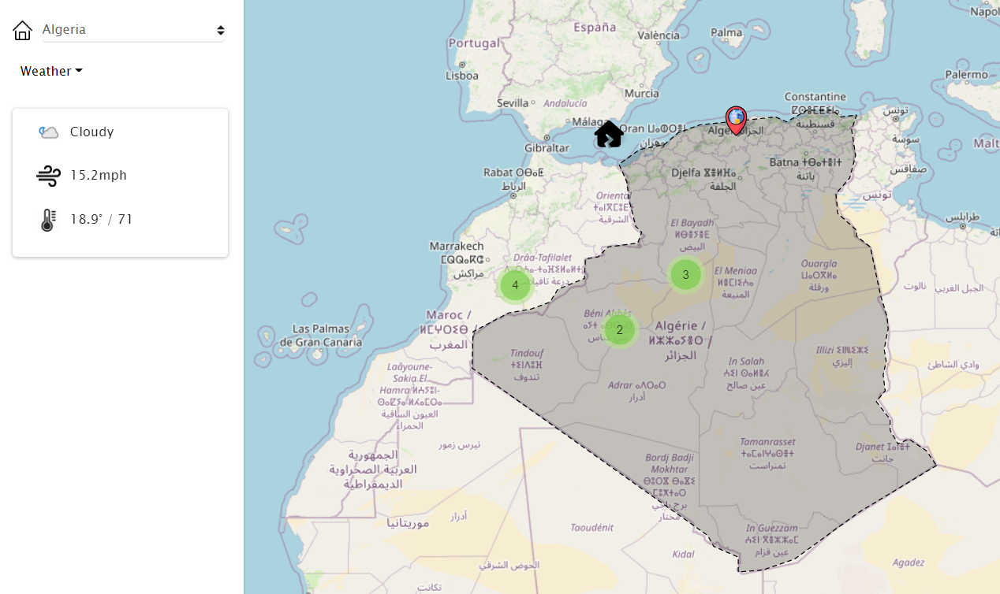

# Gazetteer
 
It provides profiling for all countries through the presentation of demographic, climatic, geographical and other data via extensive use of third party APIs. When the page loads the user's current location is used to pull the information.

## Prerequisite

- You must have a local envirment or domain setup with Mysql
- Tested on PHP 8

## Installation

- Clone the Repository into your enviroment (https://github.com/malikbensalem/gaze.git)

## How to use

it will pick current location onload:

Click on dropdown menu and select a country:

